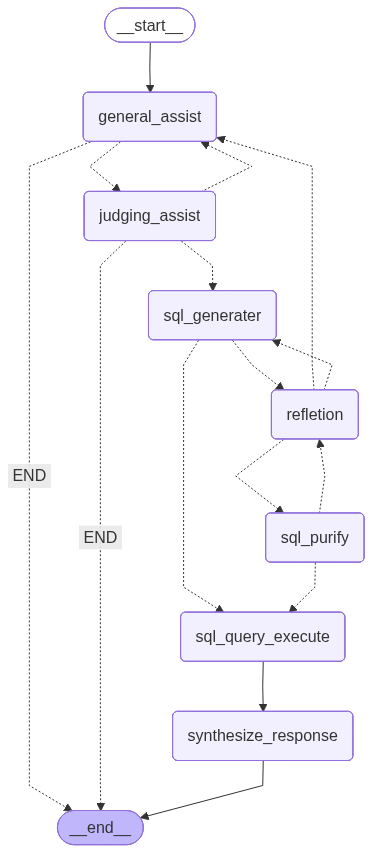

# VehicleAssist: AI-Powered Vehicle Seller Assistant

An intelligent virtual assistant for browsing and searching vehicles in a dealership database, featuring natural language interaction and MCP (Model Context Protocol) architecture.
## 📋 Table of Contents

## 🎯 Overview:
This project implements a conversational virtual assistant that helps users find vehicles in a dealership database. Instead of traditional menu-based interfaces, the assistant engages in natural conversation to understand user preferences and requirements.
Key Highlights

Natural Language Interaction: Chat with the assistant naturally - no rigid forms or menus
MCP Architecture: Clean separation between client, server, and database layers
Intelligent Search: The assistant asks relevant follow-up questions based on context
Rich Database: 100+ vehicles with realistic attributes
Terminal-Based: Runs entirely in the command line

## 🏗️ Architecture



## Description of Flowchart:
- **Data**: → processed by Agent
- **Agent**: → invokes Reflection Invoker
- **Reflection**: Invoker → dynamically selects and calls Processing Logic
- **Processing Logic**: → returns results back to the agent for further steps.

## ✨ Features

- **🤖 Virtual Agent**: Conversational AI that understands user intent
- **💬 Natural Dialogue**: Ask questions in your own words
- **🔍 Smart Filtering**: Filter by brand, model, year, fuel type, price range, and more
- **📊 Detailed Results**: View brand, model, year, color, mileage, and price
- **🔄 MCP Protocol**: Proper client-server-database architecture
- **📝 100+ Vehicles**: Pre-populated database with realistic data
- **🎨 User-Friendly**: Clear, formatted output in the terminal

## Communication Flow

- **User**: → Types natural language query in terminal
- **Client**: → Extracts filters and sends to MCP Server
- **MCP Server**: → Validates, queries database, returns results
- **Client** → Formats and displays results to user

## 🔧 Prerequisites
Before you begin, ensure you have the following installed:
- **Python**: 3.8+
- **pip**: (Python package manager)
- **Virtual environment**: (recommended)

**⚠️ Important Note**: If you enable tracing by setting `LANGCHAIN_TRACING_V2=true`, you must have a valid LangSmith API key set in `LANGCHAIN_API_KEY`. Without a valid API key, the application will throw an error. If you don't need tracing, simply remove or comment out these environment variables.

| Variable (.env) | Description | Required |
|----------|-------------|----------|
| `OPENAI_API_KEY` | Your OpenAI API key for LLM access | ⚪ |
| `GEMINI_API_KEY` | Your Gemini API key for LLM access | ⚪ |
| `OLLAMA_PUBLIC_KEY` | Your OLLAMA API key for LLM local access ex: ollama | ✅ |
| `OLLAMA_BASE_URL` | Base URL for OLLMA ex: http://127.0.0.1:11434/v1  | ✅ |
| `GEMINI_BASE_URL` | Base URL for Gemini ex: https://generativelanguage.googleapis.com/v1beta/openai/| ⚪ |
| `ANTHROPIC_BASE_URL` | Base URL for ANTHROPIC ex: https://api.anthropic.com/v1/| ⚪ |
| `LLMA_3_MODEL` | Name of the model in your OLLAMA Server machine or Other cloud server. ex: llama3 | LLMA_3_MODEL =  "llama3" |
| `LLMA_32_MODEL` | Name of the model in your OLLAMA Server machine or Other cloud server. ex: llama3.2 | LLMA_32_MODEL = "llama3.2" |
| `LLMA_QWEN_3_MODEL` | Name of the model in your OLLAMA Server machine or Other cloud server. ex: qwen3 |  LLMA_QWEN_3_MODEL = "qwen3" |
| `LLMA_QWEN_CODER_25_MODEL` | Name of the model in your OLLAMA Server machine or Other cloud server. ex: qwen2.5-coder | LLMA_QWEN_CODER_25_MODEL = "qwen2.5-coder" |
| `LANGCHAIN_API_KEY` | LangSmith API key (required if tracing enabled) | ⚪ |
| `LANGCHAIN_PROJECT` | LangSmith project name (optional) | ⚪ |

## 🛠️ Tech Stack

| Component | Technology | Description |
|-----------|------------|-------------|
| 🖥️ **Frontend** | Gradio | Web application framework |
| 🧠 **AI Framework** | LangChain 🦜🔗 | Orchestrates the AI pipeline |
| 🔍 **OpenAI** | OpenAI Agent framework | Professional profile scraping |
| 🌐 **Ollama** | Local LLM Server | Enhanced use of LLM local |
| 🤖 **LLM** | Ollama3, Ollama3.2, Qwen3, Quen2.5 coder | Powers the conversation generation |
| 📊 **Monitoring** | LangSmith | Optional tracing and debugging |
| 🐍 **Backend** | Python 3.8+ | Core application logic |

## 🚀 How to Run

1. Clone the repository:
   ```bash
   - **STEPS**
      1. git clone https://github.com/padeirocarlos/desafio-tecnico-C2S.git
         curl -fsSL https://ollama.com/install.sh | sh
         ollama server
         ollama pull ollama3  # pull one of this model: gemma4B_v gemma12B_v qwen3 gemini ollama3.2 deepseek
      2. cd desafio-tecnico-C2S
         2.1. touch .env ( create this file put your keys)
         2.2. change variable name in this files:
            - agentic/agents_client.py
            - agentic/api_base_url.py
      3. uv add -r requirements.txt
         uv run app.py

   - **Running on**:
      1. local URL:  
         http://127.0.0.1:7860
  
      2. Running on public URL: 
         output example: https://277d00fc4eb724a0ce.gradio.live

## 📄 License

This project is licensed under the MIT License - see the [LICENSE](LICENSE) file for details.

## 🌟 Support

If you find this project helpful, please consider:

* ⭐ Starring the repository
* 🐛 Reporting issues
* 💡 Contributing improvements
* 📢 Sharing with others

### 🔗 Connect with Me

[](https://www.linkedin.com/in/carlos-padeiro-24196b176)
[](https://x.com/cvpadeiro?s=11)

**Built with ❤️ by Carlos Padeiro**
